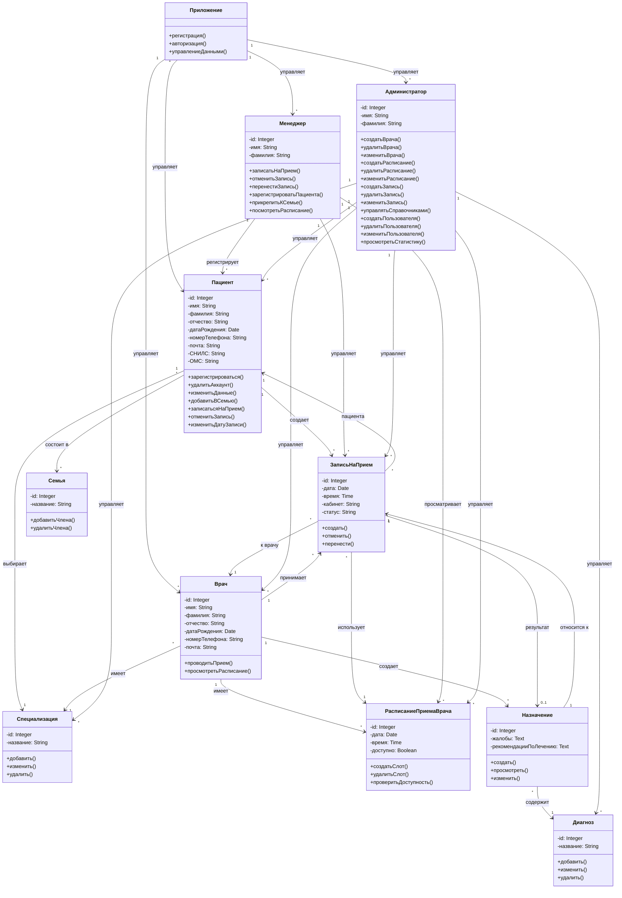

# ClinicSirius - Система управления клиникой

## Авторы (К0709-23/3)

- Ефимов Артём
- Кашапов Денис

## Тема
Система управления клиникой. 

## Требования

- Qt 6.0 или выше
- CMake 3.16 или выше
- GCC/Clang компилятор с поддержкой C++17
- Python 3.7+ (для управления скриптами)

## Быстрый старт и запуск

### Для Linux:
1. Установите зависимости:
```bash
# Любой Debian 
sudo apt-get install qt6-base-dev qt6-declarative-dev cmake build-essential

# Fedora
sudo dnf install qt6-qtbase-devel qt6-qtdeclarative-devel cmake gcc-c++
```

2. Клонируйте репозиторий:
```bash
git clone https://github.com/vinotq/clinicSiriusCpp.git
cd clinicSiriusCpp
```

3. Измените права запуска файлу `run.sh` и получите запущенное приложение:
```bash
chmod 777 run.sh
./run.sh
```

### Для Windows:
1. Запустите 


## Краткое описание
Система предназначена как для внутреннего контроля и управления (менеджеры, врачи, администраторы), так и для внешнего взаимодействия с системой (пациенты и их семьи) для записи на приём, получения результатов анализов и других медицинских операци
**ClinicSirius** - десктопное приложение для управления клиникой: ведение расписаний врачей, регистрация пациентов, запись на приём, оформление назначений и хранение диагностических данных. Приложение поддерживает роли: пациент, врач, менеджер, администратор.

## Структура проекта (основные папки)

- `include/` - заголовочные файлы 
- `src/` - реализация приложения
- `resources/` - ресурсы приложения (стили)
- `data/` - тестовые JSON-файлы с данными (пациенты, врачи, записи и т.д.)
- `ClinicSirius/` - Qt+CMake проект и файлы окружения

## Функционал

- Регистрация и авторизация пользователей (пациенты, менеджеры, врачи, администраторы)
- Управление профилями пациентов: личные данные, медицинская карта, связанная семья
- Создание+управление расписанием приёма врачей
- Запись на приём: создание, отмена, перенос записи
- Управление назначениями и результатами приёма (диагнозы, рекомендации)
- Роли и права: разграничение действий для менеджеров и администраторов
- Управление справочниками: специализации, кабинеты, диагнозы
- Просмотр статистики и журналов операций для администраторов

## Архитектура предметной области (Mermaid classDiagram)



## Технологический стек

- **Язык**: C++17
- **UI Framework**: Qt 6
- **Сборка**: CMake
- **Формат данных**: JSON
- **Парадигма**: MVC (Model-View-Controller)

## Установка и использование

### Структура данных

Приложение использует JSON-файлы для хранения данных:
- `patient.json` - профили пациентов
- `doctor.json` - информация врачей
- `appointment.json` - записи на приём
- `appointment_schedule.json` - расписание врачей
- `diagnosis.json` - справочник диагнозов
- `recipe.json` - назначения и рецепты
- `specialization.json` - медицинские специализации
- `room.json` - кабинеты клиники
- `admin.json` - администраторы
- `manager.json` - менеджеры
- `invitation_code.json` - коды приглашения
- `patient_group.json` - семьи пациентов

### Первый запуск

При первом запуске приложение загружает тестовые данные из директории `data/`. Вы можете:
- Создавать новых пользователей через интерфейс регистрации
- Редактировать справочники через администраторский интерфейс
- Добавлять новых врачей и управлять расписанием

## Роли и права доступа

### Пациент
- Регистрация и авторизация
- Запись на приём
- Просмотр своих приёмов и результатов
- Управление членами семьи

### Врач
- Просмотр расписания приёмов
- Создание расписания (слотов)
- Проведение приёма и оформление назначений
- Выписка рецептов

### Менеджер
- Регистрация пациентов
- Запись на приём от имени пациента
- Управление приёмами (отмена, перенос)
- Просмотр расписания врачей

### Администратор
- Управление всеми пользователями (создание, удаление, редактирование)
- Управление врачами и расписанием
- Управление справочниками (диагнозы, специализации, кабинеты)
- Просмотр статистики и логов операций

## Разработка и внесение изменений

### Структура кода
```
include/       # Заголовочные файлы
├── admins/    # Интерфейс администратора
├── doctors/   # Интерфейс врача
├── managers/  # Интерфейс менеджера
├── patients/  # Интерфейс пациента
└── common/    # Общие компоненты и модели

src/           # Реализация
├── admins/
├── doctors/
├── managers/
├── patients/
└── common/

resources/     # Ресурсы (стили, иконки)
```
